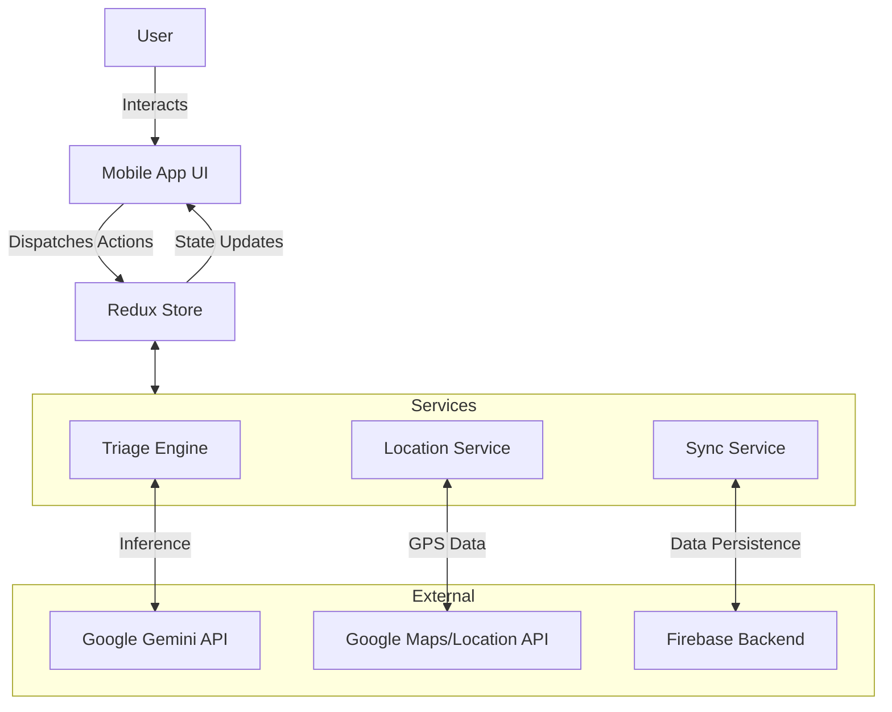

<div align="center">

<!-- Placeholder for Logo -->


# HEALTH (Help Everyone Access Local Treatment & Healthcare)

**Healthcare Made Simple for Naga City.**

<!-- Badges -->

[Live Demo](#) | [Video Walkthrough](#)

</div>

---

## Table of Contents

- [Problem Statement](#problem-statement)
- [Solution](#solution)
- [Demo](#demo)
- [Architecture](#architecture)
- [Key Features](#key-features)
- [Tech Stack](#tech-stack)
- [Getting Started](#getting-started)
- [Challenges](#challenges)
- [Future Scope](#future-scope)
- [Team](#team)
- [Acknowledgments](#acknowledgments)

---

## Problem Statement

Naga City faces a critical healthcare imbalance where the **Naga City General Hospital (NCGH)** is severely overcrowded with non-emergency cases, causing wait times of **2-4 hours**. Meanwhile, **27 barangay health centers** remain underutilized, and approximately **61% of eligible residents** have not yet enrolled in the free **YAKAP healthcare program** due to a lack of information. This disconnection prevents residents from accessing the timely, appropriate care they are entitled to.

---

## Solution

**HEALTH** is an AI-powered mobile navigation application that acts as a digital triage officer for Naga City residents. It utilizes **Google's Gemini AI** to analyze symptoms and direct users to the appropriate level of care—whether it be self-care, a barangay health center, or the emergency room. Additionally, the app streamlines enrollment in the YAKAP program and provides an offline-accessible directory of local health facilities, ensuring equitable access to healthcare resources.

---

## Demo

### AI Triage & Assessment
<!-- Placeholder for GIF/Screenshot of Chat Interface -->

### Facility Directory & YAKAP Guide
<!-- Placeholder for GIF/Screenshot of Map/List -->

---

## Architecture

The system follows a modern React Native architecture leveraging Redux for state management and Expo for seamless cross-platform deployment.


**Data Flow:** User input (symptoms) is processed by the local Triage Engine, which queries the Gemini API for semantic analysis; the result is arbitrated against local safety protocols before updating the Redux store to display a recommendation card.

---

## Key Features

- **AI-Powered Triage Assistant:** Uses Google Gemini to analyze natural language symptoms and recommend the appropriate level of care (Home, Health Center, or Hospital).
- **Localized & Multilingual:** Full support for English, Tagalog, and Bicol (Naga variant) to ensure accessibility for all demographics.
- **Smart Facility Directory:** Geo-located directory of 29+ facilities (Hospitals, Barangay Health Centers, Pharmacies) with real-time status and contact info.
- **YAKAP Program Navigator:** A guided step-by-step module to help residents check eligibility and enroll in the city's medical assistance program.
- **Offline-First Design:** Critical features, including the facility directory and basic triage algorithms, function without an active internet connection.

---

## Tech Stack

### Frontend
- **Framework:** React Native (via Expo SDK 52)
- **Language:** TypeScript
- **Navigation:** Expo Router (File-based routing)
- **UI Components:** React Native Paper, Custom Themed Components

### State Management
- **Library:** Redux Toolkit
- **Persistence:** Redux Persist (AsyncStorage)

### Backend & Services
- **AI Model:** Google Gemini Flash 1.5 (via Generative AI SDK)
- **BaaS:** Firebase (Authentication, Firestore)
- **Location:** Expo Location Services

### Development Tools
- **Linting:** ESLint
- **Build Tool:** EAS (Expo Application Services)

---

## Getting Started

### Prerequisites

- Node.js (v18 or newer)
- npm or yarn
- Expo Go app on your physical device or an Android/iOS Simulator

### Installation

1. **Clone the repository**
```bash
   git clone https://github.com/jlescarlan11/health-mobile.git
   cd health-mobile
```

2. **Install dependencies**
```bash
   npm install
```

3. **Configure Environment Variables**
   
   Create a `.env` file in the root directory based on `.env.example`:
```bash
   cp .env.example .env
```
   
   > **Note:** You will need valid API keys for Google Gemini and Firebase.

4. **Start the development server**
```bash
   npx expo start
```

5. **Run on device**
   - Scan the QR code with the Expo Go app (Android) or Camera app (iOS).
   - Press `a` to run on Android Emulator or `i` to run on iOS Simulator.

---

## Challenges

- **AI Safety & Hallucination:** Ensuring the AI strictly adheres to medical protocols without diagnosing. **Mitigation:** We implemented a "Triage Arbiter" layer that forces the AI to output structured JSON data, which is then validated against hard-coded clinical safety rules before being shown to the user.

- **Language Localization:** accurately translating medical intent across English, Tagalog, and Bicol. **Mitigation:** We utilized a custom localization dictionary combined with AI context awareness to handle local slang and dialects effectively.

- **Offline Connectivity:** Ensuring the app is useful in areas with poor data coverage. **Mitigation:** We architected a "Sync Service" using Redux Persist to cache facility data and static triage flows locally, enabling core functionality without internet.

---

## Future Scope

- **MyNaga Integration:** Full account syncing with the city's existing MyNaga portal for unified digital identity.
- **Teleconsultation:** In-app video calls with Barangay Health Workers for preliminary assessments.
- **Queue Monitoring:** Real-time integration with NCGH's queuing system to show live wait times.
- **Emergency SOS:** One-tap coordination with Naga City Rescue utilizing device location.

---

## Team

**Team CTRL+H**

- [Member Name TBD] - Full Stack Developer | [GitHub](#)
- [Member Name TBD] - UI/UX Designer | [LinkedIn](#)
- [Member Name TBD] - AI Engineer | [GitHub](#)
- [Member Name TBD] - Project Manager | [LinkedIn](#)

---

## Acknowledgments

- **Naga City Government** for organizing the Mayoral Hackathon and providing facility data.
- **Google Developer Group** for technical mentorship and Gemini API credits.
- **Open Source Community** for the incredible React Native ecosystem.
