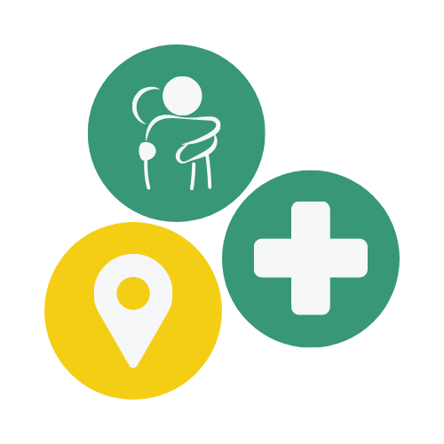
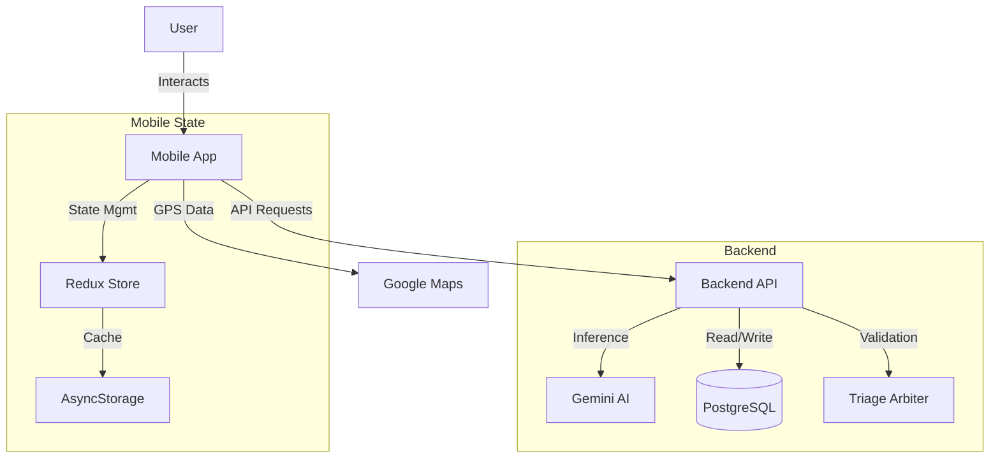

<div align="center">

<!-- Placeholder for Logo -->


# HEALTH (Help Everyone Access Local Treatment & Healthcare)

**Healthcare Made Simple for Naga City.**

<!-- Badges -->

[Live Demo](#) | [Video Walkthrough](#)

</div>

---

## Table of Contents

- [Problem Statement](#problem-statement)
- [Solution](#solution)
- [Demo](#demo)
- [Architecture](#architecture)
- [Key Features](#key-features)
- [Tech Stack](#tech-stack)
- [Getting Started](#getting-started)
- [Challenges](#challenges)
- [Future Scope](#future-scope)
- [Team](#team)
- [Acknowledgments](#acknowledgments)

---

## Problem Statement

Naga City faces a critical healthcare imbalance where the **Naga City General Hospital (NCGH)** is severely overcrowded with non-emergency cases, causing wait times of **2-4 hours**. Meanwhile, **27 barangay health centers** remain underutilized, and approximately **61% of eligible residents** have not yet enrolled in the free **YAKAP healthcare program** due to a lack of information. This disconnection prevents residents from accessing the timely, appropriate care they are entitled to.

---

## Solution

**HEALTH** is an AI-powered mobile navigation application that serves as a digital triage officer for Naga City residents. It uses **Google’s Gemini AI** through a dedicated backend to analyze symptoms and guide users to the appropriate level of care, whether self-care, a barangay health center, or the emergency room. The app also streamlines enrollment in the YAKAP program and provides an offline-accessible directory of local health facilities to ensure equitable access to healthcare resources.

---

## Demo

### AI Triage & Assessment
<!-- Placeholder for GIF/Screenshot of Chat Interface -->

### Facility Directory & YAKAP Guide
<!-- Placeholder for GIF/Screenshot of Map/List -->

---

## Architecture

The system follows a **Client-Server architecture**. The React Native mobile app serves as the frontend client, communicating with a custom Node.js/Express backend that manages data persistence and AI orchestration.


**Data Flow:** User symptoms are captured in the mobile app and sent to the backend API. The backend processes this via the Triage Engine (using Gemini AI), validates the output against safety protocols, and returns a structured recommendation. Facility data is synchronized from the PostgreSQL database to the mobile app for offline access.

---

## Key Features

- **AI-Powered Triage Assistant:** Uses Google Gemini to analyze natural language symptoms and recommend the appropriate level of care (Home, Health Center, or Hospital).
- **Localized & Multilingual:** Full support for English, Tagalog, and Bicol (Naga variant) to ensure accessibility for all demographics.
- **Smart Facility Directory:** Geo-located directory of 29+ facilities (Hospitals, Barangay Health Centers, Pharmacies) with real-time status and contact info.
- **YAKAP Program Navigator:** A guided step-by-step module to help residents check eligibility and enroll in the city's medical assistance program.
- **Offline-First Design:** Critical features, including the facility directory and basic triage algorithms, function without an active internet connection using synchronized data.

---

## Tech Stack

### Frontend (Mobile)
- **Framework:** React Native (via Expo SDK 52)
- **Language:** TypeScript
- **Navigation:** Expo Router (File-based routing)
- **State Management:** Redux Toolkit & Redux Persist
- **UI Components:** React Native Paper, Custom Themed Components

### Backend Services (Separate Repo)
- **Runtime:** Node.js & Express
- **Database:** PostgreSQL
- **ORM:** Prisma
- **AI:** Google Generative AI SDK (Gemini 1.5 Flash)

### Development & Tools
- **Build Tool:** EAS (Expo Application Services)
- **Linting:** ESLint
- **Maps:** Google Maps Platform / Expo Location

---

## Getting Started

### Prerequisites

- Node.js (v18 or newer)
- npm or yarn
- Expo Go app on your physical device or an Android/iOS Simulator
- **Backend Server:** You must have the `health-backend` repository running locally or deployed.

### Installation

1. **Clone the mobile repository**
```bash
   git clone https://github.com/jlescarlan11/health-mobile.git
   cd health-mobile
```

2. **Install dependencies**
```bash
   npm install
```

3. **Configure Environment Variables**
   
   Create a `.env` file in the root directory based on `.env.example`:
```bash
   cp .env.example .env
```
   
   Update the `API_URL` to point to your running backend instance (e.g., `http://localhost:3000`).

4. **Start the development server**
```bash
   npx expo start
```

5. **Run on device**
   - Scan the QR code with the Expo Go app (Android) or Camera app (iOS).
   - Press `a` to run on Android Emulator or `i` to run on iOS Simulator.

---

## Challenges

- **AI Safety & Hallucination:** Ensuring the AI strictly adheres to medical protocols without diagnosing.
    - **Mitigation:** We implemented a "Triage Arbiter" layer on the backend that forces the AI to output structured JSON data, which is then validated against hard-coded clinical safety rules before being sent to the client.

- **Language Localization:** accurately translating medical intent across English, Tagalog, and Bicol.
    - **Mitigation:** We utilized a custom localization dictionary combined with AI context awareness to handle local slang and dialects effectively.

- **Offline Connectivity:** Ensuring the app is useful in areas with poor data coverage.
    - **Mitigation:** We architected a "Sync Service" using Redux Persist to download and cache facility data from the PostgreSQL database, enabling core directory functionality without an internet connection.

---

## Future Scope
 
- **Admin & Predictive analytics Dashboard**
- **Health alerts and notifications** 
- **Private mode for sensitive health topics**
- **Community Forum + Expansion of Health Articles in Health Hub**
- **Telemedicine**

---

## Team

**Team CTRL+H**

- John Lester Escarlan - Project and Technical Lead | [GitHub](https://github.com/jlescarlan1)
- Nicolete Reine Guarin - Developer | [GitHub](https://github.com/aquaryasss)
- Merl Jhun Catiquista - Research and Data Collection | [GitHub](https://github.com/merljhun)
- Jen Bolat-ag - Quality Assurance | [GitHub](https://github.com/jbbolatag1-wq)
- Al Glenrey Tilacas - Creative Director | [GitHub](https://github.com/Alglenrey)
    
---

## Acknowledgments

- **Naga City Government** for organizing the Mayoral Hackathon and providing facility data.
- **Open Source Community** for the incredible React Native and Node.js ecosystems.
